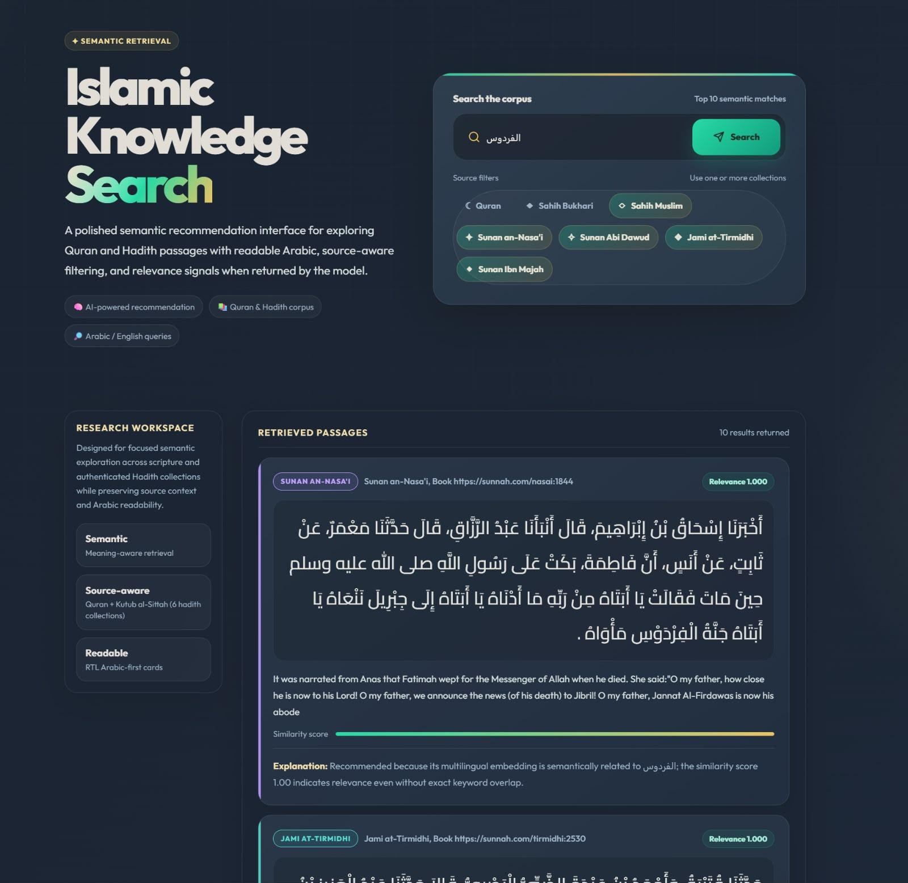
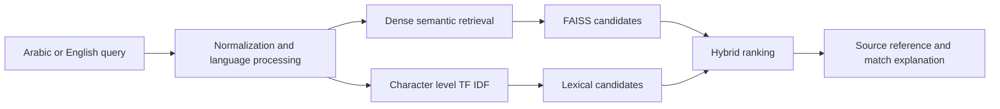

Concept illustration. The application screenshot appears below.

# Quran and Hadith Retrieval

**Find relevant passages across Arabic and English. Keep the source visible.**

A university team project combining semantic search and Arabic lexical matching to retrieve Quran verses and Hadith records with inspectable references and explanations.

**Public case study** · **Private team source** · **Retrieval benchmark pending**

[Interface](#the-interface) · [My contribution](#my-contribution) · [Architecture](#retrieval-design) · [Evidence](#evidence-and-evaluation)

## The challenge

A conceptual query may share few words with a relevant passage. Arabic diacritics, spelling variation, morphology, and differences between translations make exact matching alone insufficient.

The system combines dense and lexical retrieval, then presents the original passage alongside its source and an explanation of the match.

| Corpus | Records |
| --- | ---: |
| Quran verses | 6,236 |
| Hadith records across six major collections | 33,862 |
| **Total corpus** | **40,098** |

The Hadith corpus covers Sahih al-Bukhari, Sahih Muslim, Jami' at-Tirmidhi, Sunan Abi Dawud, Sunan an-Nasa'i, and Sunan Ibn Majah. Records retain collection, reference, language, and grading metadata.

These figures describe corpus scale. They do not measure retrieval quality.

## My contribution

I worked on Arabic normalization, hybrid retrieval, and the evaluation harness.

| Area | My work |
| --- | --- |
| Arabic processing | Normalization for retrieval while preserving the original text for display |
| Hybrid search | Combining semantic and lexical matching |
| Evaluation | A harness for ranking quality and query latency |

The system was developed collaboratively. The architecture and corpus described here belong to the team project.

## The interface

Each result card brings together:

- Original Arabic text with diacritics and right to left presentation.
- English translation.
- Source collection and reference.
- An explanation of why the passage matched.

The explanation helps the reader distinguish semantic similarity from shared wording and assess the retrieved passage in context.

## Retrieval design

| Engineering choice | Purpose |
| --- | --- |
| Multilingual embeddings | Capture conceptual similarity across Arabic and English |
| Character level TF IDF | Retain sensitivity to names, phrases, and spelling variation |
| Hybrid ranking | Combine semantic and lexical signals |
| Source metadata | Keep retrieved text connected to its collection and reference |
| Fingerprinted indexes | Rebuild cached artifacts when the corpus changes |

## Evidence and evaluation

The preserved source baseline was reviewed on **29 July 2026**.

| Check | Recorded result |
| --- | --- |
| Dependency independent tests | 10 passed |
| Python compilation | Passed |
| Corpus loader | 40,098 records returned |
| Full FAISS execution | Pending in the verification environment |

These are results from that baseline review, not a new execution of the system.

The private workspace includes an evaluation harness for `Precision@5`, `Recall@5`, `F1@5`, `MRR`, `nDCG@5`, and query latency.

**No retrieval quality figures are published.** The current relevance set contains only a handful of starter queries. It exercises the harness but cannot support a reliable performance claim for this corpus.

A credible benchmark needs a larger relevance set with qualified human review, hard negatives, morphology focused cases, and separate results by language and collection.

## Next steps

1. Expand the Arabic and English relevance set.
2. Add hard negatives and morphology focused failure cases.
3. Compare lexical, dense, and hybrid retrieval under one frozen protocol.
4. Report quality separately by language and collection.
5. Add citation feedback while preserving source text.

## Repository scope

This public repository contains the system case study, interface image, architecture, evaluation contract, evidence status, and roadmap.

The full source and bundled corpus remain in a private team repository while dataset attribution and the complete evaluation path are reviewed.

## Responsible use

This is an information retrieval project, not a source of religious rulings. Retrieval relevance must not be presented as religious authority. Results should retain their original text, source reference, grading metadata, and human review context.
