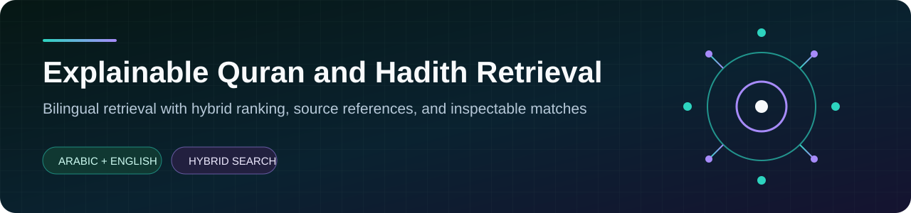
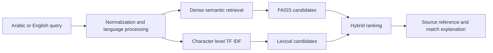

  

  
  
  

A bilingual retrieval system for discovering relevant Quran verses and Hadith
records through semantic similarity, Arabic aware lexical matching, and
inspectable source references.

> Developed collaboratively as a university team project. This repository is
> the public system case study; the active source workspace remains private.

## At a glance

<table>
  <tr>
    <td align="center"><strong>40,098</strong> indexed records</td>
    <td align="center"><strong>6,236</strong> Quran verses</td>
    <td align="center"><strong>33,862</strong> Hadith records</td>
    <td align="center"><strong>6</strong> major Hadith collections</td>
  </tr>
</table>

## Why it matters

Arabic religious text retrieval cannot depend on exact word overlap. Diacritics,
letter variants, morphology, translation differences, and conceptual queries
can separate a useful result from the wording entered by a user.

The system combines lexical and semantic signals so no single retrieval method
controls the result. Each result preserves its source reference and includes a
short explanation that supports human review.

## Retrieval design

### Engineering choices

| Decision | Purpose |
| --- | --- |
| Multilingual embeddings | Capture conceptual similarity across Arabic and English |
| Character level TF IDF | Remain sensitive to names, phrases, and Arabic spelling variation |
| Hybrid ranking | Balance semantic recall with lexical precision |
| Source aware records | Preserve collection, reference, language, and grading metadata |
| Fingerprinted indexes | Rebuild cached artifacts when the underlying corpus changes |
| Explainable result cards | Show why a record matched without hiding the original source |

## Evaluation contract

The private workspace includes an evaluation harness for:

`Precision@5` `Recall@5` `F1@5` `MRR` `nDCG@5` `Query latency`

The current gold file is a starter benchmark. Strong retrieval quality claims
require a larger relevance set reviewed by qualified humans, with results
reported separately by language and source.

## Verified state

The preserved source baseline was reviewed on 29 July 2026.

| Check | Result |
| --- | --- |
| Dependency independent tests | 10 passed |
| Python compilation | Passed |
| Corpus loader | 40,098 records returned |
| Full FAISS execution | Pending in the verification environment |

## Public and private boundary

This public repository contains the architecture, evaluation contract, verified
state, limitations, and roadmap. The full source and bundled corpus remain in a
private team repository while dataset attribution and the complete retrieval
evaluation path are reviewed.

## Roadmap

1. Expand Arabic and English benchmark queries.
2. Add hard negatives and morphology focused failure cases.
3. Compare lexical, dense, and hybrid methods under one frozen protocol.
4. Report quality separately by language and collection.
5. Add citation level feedback without altering source texts.

## Responsible use

This is an information retrieval project, not a source of religious rulings.
Retrieval relevance must never be presented as religious authority. Results
should preserve their original text, source reference, grading metadata, and
human review context.
